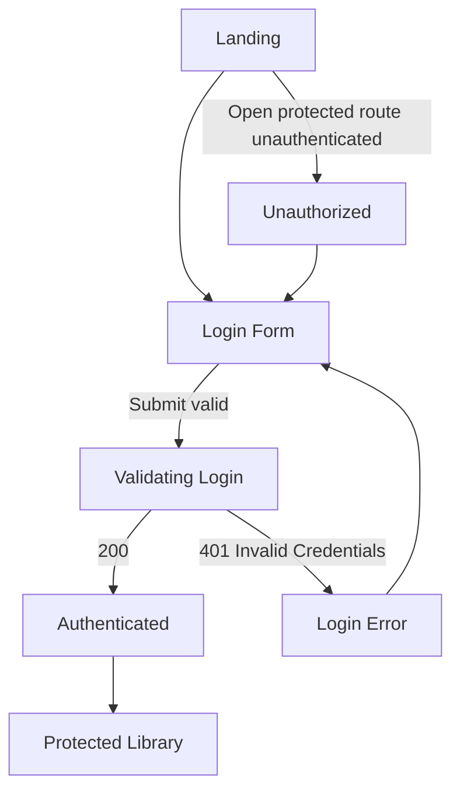
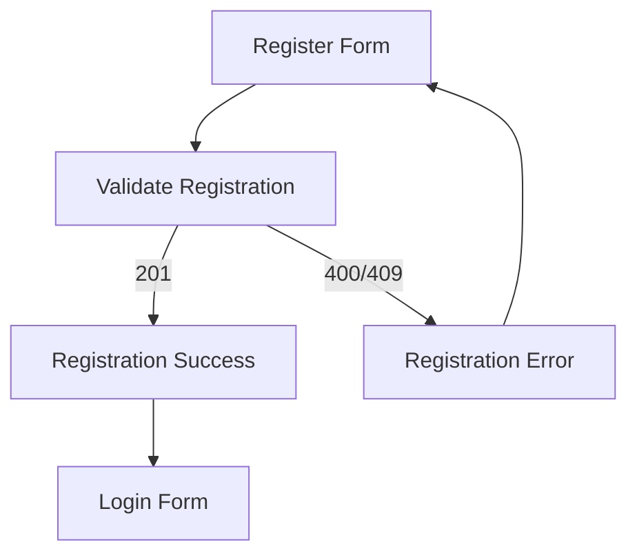
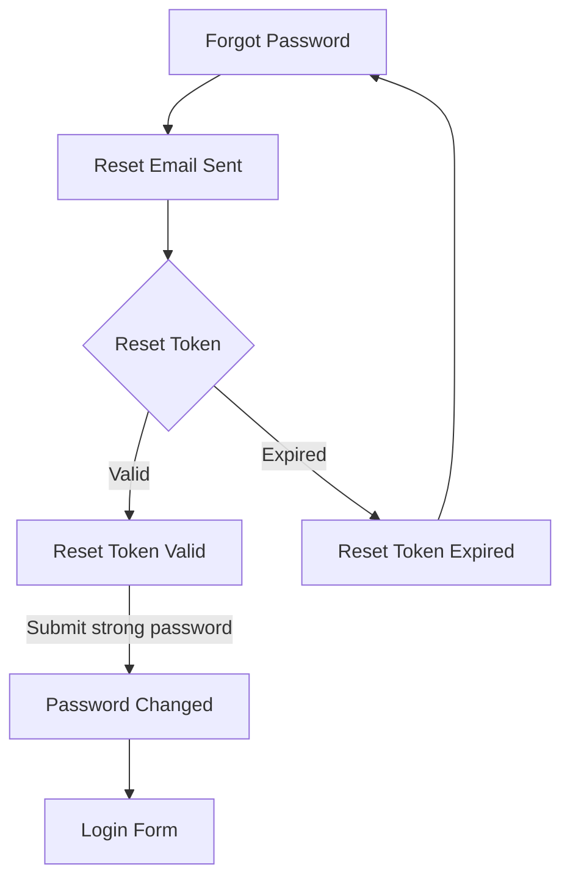
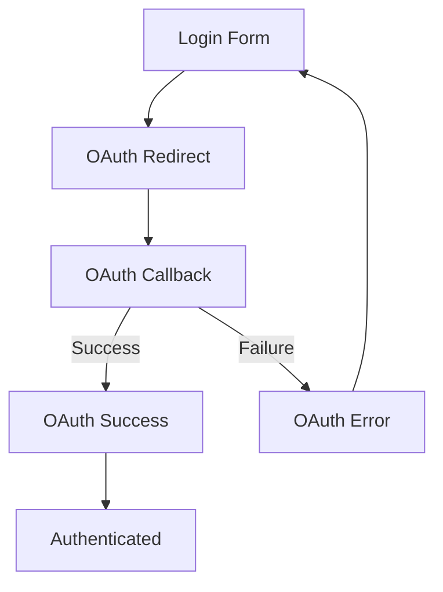
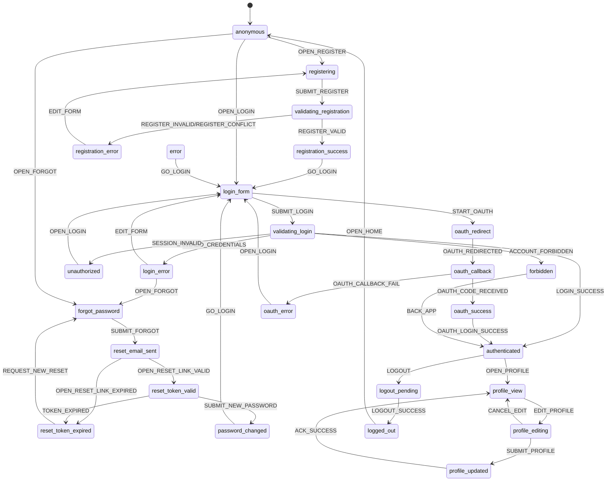
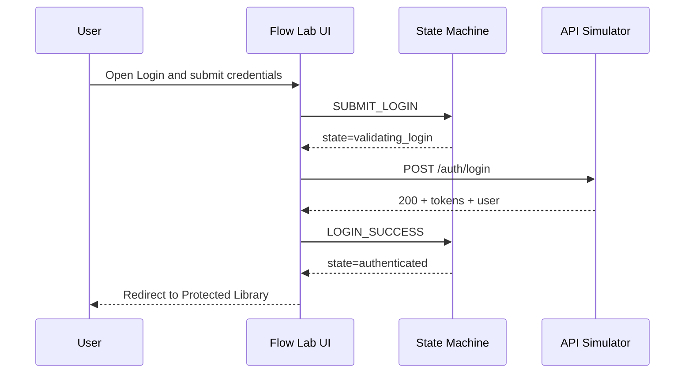
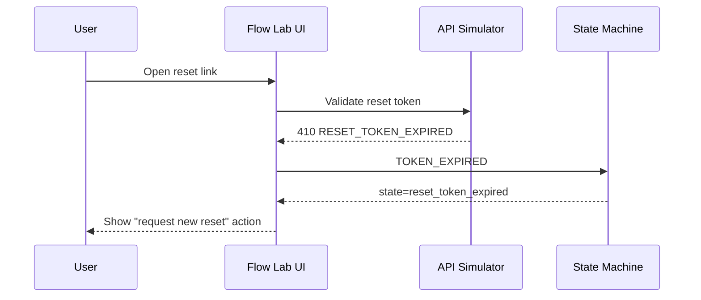

# Hypertube Auth Flow Lab

## 1) Application Overview

**Hypertube Auth Flow Lab** is a standalone, browser-based interactive prototype specification used to design and validate authentication UX before backend implementation.

It is a visual simulator and documentation system for:
- Registration and login
- OAuth with 42 and a secondary provider
- Password reset
- Profile management
- Protected routes and API auth behaviors
- Error/security/validation outcomes

No real authentication, backend, or database is implemented.

## 2) UX Goals

1. Let stakeholders click through auth flows.
2. Visualize state transitions and route transitions.
3. Surface simulated API request/response behavior.
4. Expose validation and authorization failures clearly.
5. Produce a shared source of truth for frontend, backend, QA, UX, and product.
6. Drive edge-case and security-first requirements discussions.

Design principles:
- Clarity over visual flair
- Explainability for non-developers
- Modern and minimal workspace
- Fast comparison of happy path vs failure path

## 3) Information Architecture

### Primary Workspace Regions

- **Left Panel: Flow Screens**
  - Landing Page
  - Login
  - Register
  - OAuth Login
  - Forgot Password
  - Reset Password
  - Profile
  - Protected Library
  - Logout

- **Center Panel: Flow Visualization**
  - User Flow graph
  - State Machine graph
  - Route Graph
  - Current node highlight + animated transitions

- **Right Panel: Inspector**
  - Current State
  - Current Route
  - User Action
  - Expected API Call
  - Request Payload
  - Response Payload
  - HTTP Status
  - Error Code / Message
  - Security Notes
  - Validation Rules
  - Test Cases
  - Open Questions

- **Bottom Panel: Event Timeline**
  - Chronological simulation log (action, validation, request, response, state/route change)

## 4) Layout Blueprint

### Three-Column + Timeline Layout

- Header: scenario selector, reset simulation, share/export controls.
- Left rail: screen navigation tree and quick presets (happy/error/security).
- Center canvas tabs:
  - User Journey
  - Statechart
  - Route Tree
  - Sequence Diagram (future-ready tab active when configured)
- Right inspector: context-sensitive details for selected node/event.
- Bottom timeline: append-only event stream with filtering (`all`, `user`, `api`, `validation`, `security`).

### Interaction Rules

- Clicking a screen changes active route and available actions.
- Triggered actions animate center graph edges.
- Inspector always reflects selected node/event context.
- Timeline entries are immutable and timestamped in simulation order.

## 5) State Machine Specification

### State Catalog

| State | Description | Entry Conditions | Exit Conditions | Possible Transitions | Trigger Events |
|---|---|---|---|---|---|
| `anonymous` | No authenticated session | App start, logout complete, session expired | User chooses auth flow | `registering`, `login_form`, `oauth_redirect`, `forgot_password`, `unauthorized` | `OPEN_REGISTER`, `OPEN_LOGIN`, `START_OAUTH`, `OPEN_FORGOT`, `ACCESS_PROTECTED` |
| `registering` | Registration form visible | `OPEN_REGISTER` from anonymous | Submit/cancel | `validating_registration`, `anonymous` | `SUBMIT_REGISTER`, `CANCEL` |
| `validating_registration` | Form and server validation running | Register submit | Validation result returned | `registration_success`, `registration_error` | `REGISTER_VALID`, `REGISTER_INVALID`, `REGISTER_CONFLICT`, `SERVER_FAIL` |
| `registration_success` | Account created and success shown | Register API success | Continue to login or auto-auth | `login_form`, `authenticated` | `GO_LOGIN`, `AUTO_LOGIN_SUCCESS` |
| `registration_error` | Registration failed | Register API validation/conflict/server error | Retry/edit/cancel | `registering`, `error` | `EDIT_FORM`, `RETRY`, `UNHANDLED_ERROR` |
| `login_form` | Login form visible | `OPEN_LOGIN` or post-registration | Submit/oauth switch/back | `validating_login`, `oauth_redirect`, `anonymous` | `SUBMIT_LOGIN`, `START_OAUTH`, `BACK` |
| `validating_login` | Credential validation in progress | Login submit | API response | `authenticated`, `login_error`, `unauthorized`, `forbidden` | `LOGIN_SUCCESS`, `INVALID_CREDENTIALS`, `SESSION_INVALID`, `ACCOUNT_FORBIDDEN` |
| `authenticated` | Session active | Login/oauth success, valid existing session | Logout/session expiry/access denied | `profile_view`, `profile_editing`, `logout_pending`, `forbidden`, `error` | `OPEN_PROFILE`, `EDIT_PROFILE`, `LOGOUT`, `AUTHZ_DENIED`, `SERVER_FAIL` |
| `login_error` | Login failure shown | Invalid credentials or malformed login request | Retry or recovery path | `login_form`, `forgot_password` | `EDIT_FORM`, `OPEN_FORGOT` |
| `oauth_redirect` | Redirect preparation to provider | OAuth selected | Provider callback initiated/failure | `oauth_callback`, `oauth_error` | `OAUTH_REDIRECTED`, `OAUTH_PROVIDER_FAILED` |
| `oauth_callback` | Callback processing | Provider returns to callback route | Token exchange result | `oauth_success`, `oauth_error` | `OAUTH_CODE_RECEIVED`, `OAUTH_CALLBACK_FAIL` |
| `oauth_success` | OAuth auth completed | Token exchange/profile link success | Continue into app | `authenticated` | `OAUTH_LOGIN_SUCCESS` |
| `oauth_error` | OAuth flow failed or link required | Provider error/state mismatch/link required | Retry provider or fallback login | `oauth_redirect`, `login_form`, `error` | `RETRY_OAUTH`, `OPEN_LOGIN`, `UNHANDLED_ERROR` |
| `forgot_password` | Forgot form visible | User chose recovery | Submit/back | `reset_email_sent`, `login_form` | `SUBMIT_FORGOT`, `BACK_LOGIN` |
| `reset_email_sent` | Confirmation that reset email was sent | Forgot endpoint accepted request | User opens reset link | `reset_token_valid`, `reset_token_expired` | `OPEN_RESET_LINK_VALID`, `OPEN_RESET_LINK_EXPIRED` |
| `reset_token_valid` | Reset token accepted | Valid token in reset route | Submit new password/cancel | `password_changed`, `reset_token_expired` | `SUBMIT_NEW_PASSWORD`, `TOKEN_EXPIRED` |
| `reset_token_expired` | Reset token invalid/expired | Expired/invalid token | Request new reset | `forgot_password` | `REQUEST_NEW_RESET` |
| `password_changed` | Password reset succeeded | Reset endpoint success | Return to login | `login_form` | `GO_LOGIN` |
| `profile_view` | Profile read-only view | Authenticated user opens profile | Edit/refresh/error | `profile_editing`, `profile_updated`, `error` | `EDIT_PROFILE`, `REFRESH_PROFILE`, `SERVER_FAIL` |
| `profile_editing` | Profile form active | Enter edit mode | Submit/cancel | `profile_updated`, `profile_view` | `SUBMIT_PROFILE`, `CANCEL_EDIT` |
| `profile_updated` | Profile update confirmation | Patch profile success | Return to view | `profile_view` | `ACK_SUCCESS` |
| `logout_pending` | Logout request in progress | Logout clicked | API success/failure | `logged_out`, `error` | `LOGOUT_SUCCESS`, `LOGOUT_FAIL` |
| `logged_out` | Session removed and user returned | Logout success | Navigate onward | `anonymous`, `login_form` | `OPEN_HOME`, `OPEN_LOGIN` |
| `unauthorized` | Missing/invalid authentication | Protected route/API without valid auth | Re-authenticate | `login_form`, `anonymous` | `OPEN_LOGIN`, `BACK_HOME` |
| `forbidden` | Authenticated but insufficient permission | RBAC/ownership check failed | Navigate elsewhere | `authenticated`, `profile_view` | `BACK_APP`, `OPEN_PROFILE` |
| `error` | Unexpected unrecoverable state | Unhandled API/system issue | Retry/recover/restart | `anonymous`, `login_form` | `RESTART`, `GO_LOGIN` |

## 6) Simulated Route Catalog

| Route | Purpose | Auth Required | Request Payload | Success Response | Status Codes | Possible Errors |
|---|---|---|---|---|---|---|
| `POST /auth/register` | Create account | No | `{ username, email, password }` | `{ userId, username, email }` | `201, 400, 409, 500` | `REQUIRED_FIELD`, `INVALID_EMAIL`, `WEAK_PASSWORD`, `USERNAME_TAKEN`, `EMAIL_TAKEN`, `SERVER_ERROR` |
| `POST /auth/login` | Username/password auth | No | `{ login, password }` | `{ accessToken, refreshToken, user }` | `200, 400, 401, 403, 429, 500` | `INVALID_CREDENTIALS`, `REQUIRED_FIELD`, `UNAUTHORIZED`, `FORBIDDEN`, `SERVER_ERROR` |
| `GET /auth/oauth/42` | Begin 42 OAuth | No | None | Redirect metadata | `302, 500` | `OAUTH_PROVIDER_FAILED`, `SERVER_ERROR` |
| `GET /auth/oauth/provider` | Begin secondary OAuth | No | None | Redirect metadata | `302, 500` | `OAUTH_PROVIDER_FAILED`, `SERVER_ERROR` |
| `GET /auth/oauth/callback` | Finalize OAuth | No | Query: `{ code, state }` | `{ accessToken, user, linked }` | `200, 400, 401, 409, 500` | `OAUTH_PROVIDER_FAILED`, `OAUTH_ACCOUNT_LINK_REQUIRED`, `UNAUTHORIZED`, `SERVER_ERROR` |
| `POST /auth/password/forgot` | Send reset email | No | `{ email }` | `{ message: "reset_sent" }` | `200, 400, 429, 500` | `INVALID_EMAIL`, `REQUIRED_FIELD`, `SERVER_ERROR` |
| `POST /auth/password/reset` | Set new password | No | `{ token, password }` | `{ message: "password_changed" }` | `200, 400, 410, 500` | `WEAK_PASSWORD`, `RESET_TOKEN_EXPIRED`, `SERVER_ERROR` |
| `POST /auth/logout` | End user session | Yes | Optional `{ refreshToken }` | `{ message: "logged_out" }` | `200, 401, 500` | `UNAUTHORIZED`, `SERVER_ERROR` |
| `GET /me` | Get current user profile | Yes | None | `{ id, username, email, avatar, providerLinks }` | `200, 401, 403, 500` | `UNAUTHORIZED`, `FORBIDDEN`, `SERVER_ERROR` |
| `PATCH /me` | Update current user profile | Yes | `{ username?, email?, avatar? }` | Updated profile | `200, 400, 401, 403, 409, 500` | `INVALID_EMAIL`, `USERNAME_TAKEN`, `EMAIL_TAKEN`, `UNAUTHORIZED`, `FORBIDDEN`, `SERVER_ERROR` |
| `GET /users/:id` | View user profile by id | Yes | Path param: `id` | `{ id, username, avatar, visibility }` | `200, 401, 403, 404, 500` | `UNAUTHORIZED`, `FORBIDDEN`, `SERVER_ERROR` |
| `PATCH /users/:id` | Admin/self profile mutation | Yes + permission | `{ role?, status?, profile? }` | Updated user resource | `200, 400, 401, 403, 404, 500` | `FORBIDDEN`, `UNAUTHORIZED`, `REQUIRED_FIELD`, `SERVER_ERROR` |

## 7) Unified Error Model and Catalog

### Canonical Error Shape

```json
{
  "error": {
    "code": "INVALID_CREDENTIALS",
    "message": "Username or password is invalid.",
    "field": "password"
  }
}
```

### Error Catalog

| Error Code | Meaning | When It Occurs | Recommended UX Behavior | Recommended UI Message |
|---|---|---|---|---|
| `REQUIRED_FIELD` | Required input missing | Any form submit with empty required field | Inline field highlight + keep submit enabled after correction | "This field is required." |
| `INVALID_EMAIL` | Email format invalid | Register/forgot/profile update | Inline validation + autofocus field | "Enter a valid email address." |
| `INVALID_USERNAME` | Username format invalid | Register/profile update | Show allowed pattern helper text | "Username must match required format." |
| `WEAK_PASSWORD` | Password policy unmet | Register/reset password | Show password checklist and unmet criteria | "Password is too weak." |
| `USERNAME_TAKEN` | Username already exists | Register/profile update | Suggest alternatives | "Username is already taken." |
| `EMAIL_TAKEN` | Email already exists | Register/profile update | Offer login or password reset action | "Email is already registered." |
| `INVALID_CREDENTIALS` | Login credentials invalid | Login submit | Non-specific auth error + retry | "Username or password is invalid." |
| `OAUTH_PROVIDER_FAILED` | Provider auth exchange failed | OAuth redirect/callback | Retry OAuth and fallback to password login | "OAuth provider failed. Try again." |
| `OAUTH_ACCOUNT_LINK_REQUIRED` | Existing account needs linking | OAuth callback with account conflict | Present account-linking branch | "Link your existing account to continue." |
| `RESET_TOKEN_EXPIRED` | Reset token invalid/expired | Reset password submit or token open | Route to forgot-password with context banner | "Reset link expired. Request a new one." |
| `UNAUTHORIZED` | Missing/invalid authentication | Protected routes/API without valid session | Redirect to login preserving return route | "Please sign in to continue." |
| `FORBIDDEN` | Authenticated but no permission | Access denied by role/ownership | Show blocked state with safe back actions | "You do not have access to this action." |
| `SERVER_ERROR` | Generic internal failure | Unexpected backend/system issue | Show retry and support path | "Something went wrong. Try again." |

## 8) User Flow Diagrams

### Login + Protected Route



### Registration



### Password Reset



### OAuth



## 9) Statechart Definitions



## 10) Sequence Diagrams

### Login Sequence



### Password Reset Sequence (Expired Token)



## 11) Test Case Matrix

| Flow | Happy Path | Validation Errors | Authorization Errors | Security Cases | Edge Cases |
|---|---|---|---|---|---|
| Registration | Valid new account | Missing email, weak password, invalid username | N/A | Rate-limit repeated registration attempts, bot-like payloads | Existing email/username race condition |
| Login | Valid credentials -> authenticated | Missing password, malformed login field | Already authenticated user opens login | Brute force throttling, credential stuffing simulation | Locked account, expired session |
| OAuth (42/provider) | Redirect -> callback -> authenticated | Missing callback code/state mismatch | Callback with revoked user access | OAuth CSRF state mismatch, token replay attempt | Account exists but link required |
| Forgot Password | Submit email -> reset email sent | Invalid/missing email | N/A | Email enumeration-safe messaging, request throttling | Rapid repeated requests |
| Reset Password | Valid token + strong password | Weak password, missing token | N/A | Token reuse, expired token, short reset window | Open reset on another device |
| Profile View/Edit | Authenticated user views/updates own profile | Invalid email/username update | User without permissions attempts restricted update | Input sanitization on profile fields | Concurrent edits, stale data |
| Protected Library | Authenticated access succeeds | N/A | Anonymous access denied; forbidden role denied | Session expiry mid-navigation | Deep link directly into protected route |
| Logout | Valid logout and state cleared | N/A | Invalid session token on logout | Session invalidation across tabs | Logout during pending API call |

## 12) Security Review Checklist

### Per-Route/State Review Fields (Inspector)

- Authentication risks identified
- Authorization risks identified
- Validation rules complete and explicit
- Input sanitization documented
- Rate limiting rule defined
- CSRF treatment defined (where cookie/session applies)
- Session storage/expiry behavior documented
- OAuth `state`, callback, and account-linking checks documented

### Security Controls by Concern

- **Authentication**: secure credential transport, lockout/throttle model, session timeout.
- **Authorization**: ownership and role checks on `/users/:id`, forbidden state behavior.
- **Validation/Sanitization**: strict schema validation and output-safe rendering.
- **CSRF**: anti-CSRF token for cookie-based authenticated mutations.
- **Rate limiting**: login/register/forgot/reset endpoints throttled.
- **Session**: rotation on login, invalidation on logout, expiry handling UX.
- **OAuth**: validate `state`, prevent replay, enforce callback origin, handle provider failures safely.

## 13) Future Extensions

1. Multi-factor authentication (TOTP/WebAuthn) flow nodes.
2. Session management dashboard (active sessions, revoke session).
3. Account linking/unlinking visual branch editor.
4. Localization and accessibility simulation modes.
5. Export to JSON/Markdown artifacts for QA and API contract reviews.
6. Scenario diff mode (compare two authentication policies side-by-side).
7. Threat-model overlay on routes/states.

---

## Prototype Scope Guardrails

- This repository contains a **product and UX blueprint** for a standalone auth-flow simulator.
- It intentionally excludes backend logic, persistent storage, and real authentication execution.
